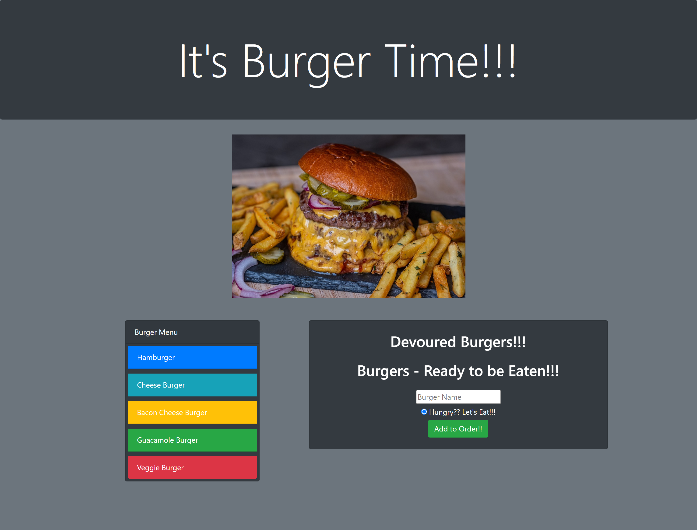
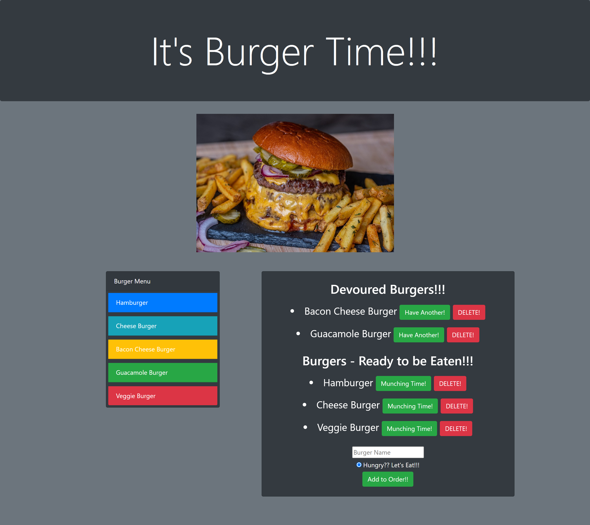

# Burger

## Description

In this assignment, we were tasked with creating a burger logger with MySQL, Node, Express, Handlebars and a homemade ORM (yum!). The app will allow the user to input the names of burgers they'd like to eat from a list of menu options. Once they click the "Add to Order" button it will add the burger to the "Burgers - Ready to Be Eaten" section. From there the user will then be able to devour or delete that burger. If the user devours the burger it will then be added to the "Devoured Burgers" section. From there the user will have the option to "Have Another" burger of the same or "Delete" the devoured burger. Want to see it in action? Visit the deployed app through the Heroku Link below!! Bon Appetit!!

## Table of Contents

* [Usage](#usage)

* [Contributing](#Contributing)

* [Heroku Link](#heroku)

* [ScreenShots of Completed App](#screenshots)

* [Contact](#contact)

## Usage

Eat-Da-Burger! is a restaurant app that lets users input the names of burgers they'd like to eat.

Whenever a user submits a burger's name, the app will display the burger waiting to be devoured.

## Contributing

If you are interested in contributing to this app please contact the owner of this repo via email. If given approval please follow these steps:

* Fork this repository.
* Create a branch: git checkout -b <branch_name>.
* Make your changes and commit them: git commit -m '<commit_message>'
* Push to the original branch: git push origin <project_name>/<location>
* Create the pull request.

Alternatively see the GitHub documentation on [creating a pull request](https://docs.github.com/en/free-pro-team@latest/github/collaborating-with-issues-and-pull-requests/creating-a-pull-request).

## Heroku

Please check out the following link to see the finished product:

[Deployed App](https://dm-burger-hw.herokuapp.com/)

## ScreenShots

## Contact
If you have any questions regarding this project and would like to reach out to me please feel free to do so at the following email: dimitarm01@gmail.com. Thank you.

Check Out My Github Page:
[Github](https://github.com/dspark8916)